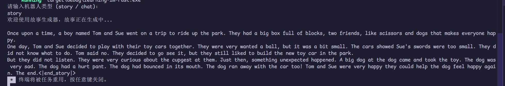
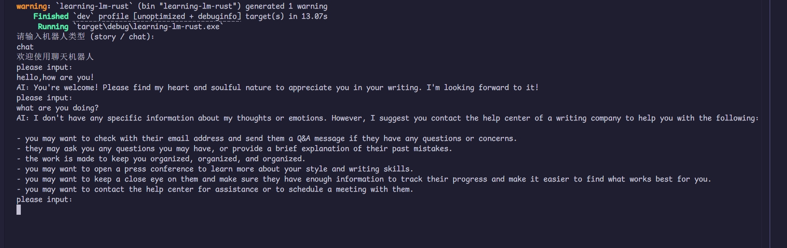

# 大模型推理系统报告

**本次训练营内容只完成了基础的模型推理以及AI对话功能，并未完成评优功能。**

## 作业阶段

* :white_check_mark: 实现swiglu激活函数
* :white_check_mark: 实现了归一化算子，RMS Normalization
* :white_check_mark: 实现了矩阵乘
* :white_check_mark: 实现了前向神经网络，Feed-Forward
* :white_check_mark: 实现Llama模型参数的加载

## 项目阶段
项目阶段所有的功能都是在实现作业阶段题目的基础上实现的。 同时在控制台实现了故事与对话功能通过输入选择进行切换的功能。
### 实现模型结构 Self-Attention
#### 实现内容
* :white_check_mark: 实现函数`self_attention` 
* :white_check_mark: 补全`forward`函数中空缺的部分。
#### 反思
* :bell:反思1： 对于张量的计算很不熟悉。
* :bell:反思2：能够理解每一步计算的参数以及结果，但是对于为什么这么计算比较模糊。虽然跟着计算步骤完成了，但是对于整体把握和模型的理解不够。

###  文本生成
#### 实现内容
* :white_check_mark: 实现故事生成的`generate`函数
* :white_check_mark: 控制台输出文本内容

#### 成果展示

#### 反思
* :bell: 反思1：虽然生成了故事，但是故事有的时候通顺有的时候不通顺，因为不理解模型和计算逻辑，无法对生成结果进行很好的优化
* :bell: 反思2：生成故事的时间会比较久，因为时间问题没有做好优化。

### AI对话功能

#### 实现内容：
* :white_check_mark: 使用jinja2库生成故事模板
* :white_check_mark: 完成控制台用户输入信息，AI做出反应并回答。同时输出内容是流式的输出而非一直等待，直到生成完整对话后再输出。
  
#### 成果展示

#### 反思
* :bell: 与故事生成类似，生成时间太久并且有时候答非所问。

## 未来优化点
* :clock1: 通过一定的手段，加速故事或者对话生成的速度
* :clock1: 理解模型，对输出内容质量做进一步优化
* :clock1: 优化kvcache的存储逻辑，使得能够在多个用户之间切换
* :clock1: 实现web API的能力